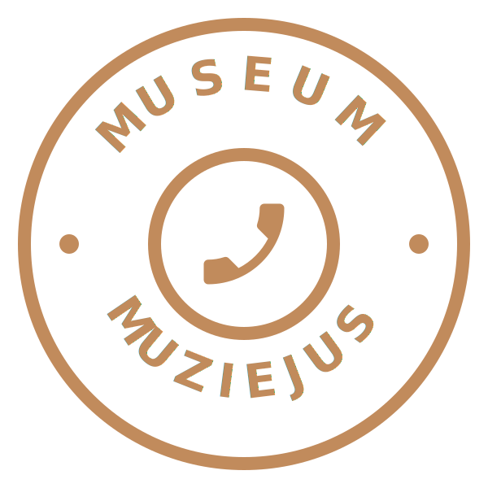

<p align="center">
  
</p>

<h1 align="center">Telephony Museum</h1>

<p align="center">
  <strong>The History You Can Touch.</strong><br>
  Explore the evolution of human connection — from drum signals to cloud telephony — in a historic 1907 treasury building in Šiauliai, Lithuania.
</p>

<p align="center">
  <a href="https://telephony.museum">🌐 telephony.museum</a> · <a href="https://www.facebook.com/telephonymuseum">Facebook</a>
</p>

<p align="center">
  
</p>

---

## About

The Telephony Museum houses **1,200+ artifacts** spanning the entire history of telecommunications — rotary dial telephones, manual switchboards, early mobile phones, and modern VoIP equipment. Located inside a beautifully restored 1907 treasury building, the museum offers guided tours, hands-on educational programs, and rotating exhibitions.

This repository contains the source code for the museum's official website.

## Tech Stack

- **[Astro](https://astro.build)** — Static site generator (zero JS by default)
- **[Tailwind CSS](https://tailwindcss.com)** — Utility-first styling
- **TypeScript** — Type-safe translations and data

The site is fully static — no server runtime, no database. Every page is pre-rendered at build time.

## Languages

The website is available in **9 languages**:

| Code | Language | Flag |
|------|----------|------|
| `en` | English (default) | 🇬🇧 |
| `lt` | Lithuanian | 🇱🇹 |
| `lv` | Latvian | 🇱🇻 |
| `pl` | Polish | 🇵🇱 |
| `ru` | Russian | 🇷🇺 |
| `de` | German | 🇩🇪 |
| `et` | Estonian | 🇪🇪 |
| `es` | Spanish | 🇪🇸 |
| `uk` | Ukrainian | 🇺🇦 |

**Want to add your language?** See [Contributing](#contributing) below — we'd love help translating the museum for more visitors!

## Development

```sh
npm install       # Install dependencies
npm run dev       # Start dev server at localhost:4321
npm run build     # Build production site to ./dist/
npm run preview   # Preview the build locally
```

Requires **Node.js 18+** and npm.

## Project Structure

```
src/
├── assets/images/     # Museum photographs (optimized at build time)
├── components/        # Astro components (Hero, Exposition, Footer, etc.)
├── data/site.ts       # Site-wide configuration (name, contacts, social links)
├── i18n/
│   ├── types.ts       # Translation interface (TypeScript)
│   ├── index.ts       # Language registry and helpers
│   ├── en.ts          # English translations (default)
│   ├── lt.ts          # Lithuanian
│   └── ...            # One file per language
├── layouts/
│   └── BaseLayout.astro   # HTML shell, meta tags, Schema.org
├── pages/
│   ├── index.astro        # Homepage (EN)
│   ├── exposition.astro   # Exposition page (EN)
│   ├── education.astro    # Educational programs (EN)
│   ├── prices.astro       # Pricing & hours (EN)
│   ├── contacts.astro     # Contact & visit info (EN)
│   ├── parama.astro       # Support the museum (EN)
│   ├── statute.astro      # Legal statute (EN)
│   ├── 404.astro          # Not found
│   └── [lang]/            # Same pages for other 8 languages
│       ├── index.astro
│       ├── exposition.astro
│       └── ...
├── styles/
│   └── global.css         # Tailwind directives and custom styles
public/
├── logo.svg           # Museum logo
├── og-image.jpg       # Social sharing image
├── favicon.png        # Browser favicon
└── robots.txt         # Search engine directives
```

## Contributing

Contributions are very welcome! Whether you speak a language we don't support yet, know the history of telephony, or just want to improve the site — we'd love your help.

### 🌍 Add a New Language

This is the easiest and most impactful way to contribute. Each language is a single TypeScript file.

1. **Copy** `src/i18n/en.ts` to `src/i18n/{your-lang-code}.ts` (e.g., `fr.ts` for French)
2. **Translate** all the string values (keep the keys in English)
3. **Update** `src/i18n/index.ts`:
   - Import your file: `import { fr } from "./fr";`
   - Add it to the `languages` object: `fr,`
4. **Update** `src/i18n/types.ts` — add your language code to the `Lang` type if it exists
5. **Run** `npm run build` to verify everything compiles — Astro will automatically generate all pages for the new language

That's it! The routing (`/{lang}/page/`) and language switcher are fully automatic.

### 🏛️ Add Exposition Detail Pages

Each exhibit in the museum (vintage telephones, switchboards, mobile phones, etc.) could have its own dedicated page with rich descriptions, historical context, and high-quality photographs. This is a great area for contributors who are passionate about telecom history.

To add a new exposition page:
1. Add the content to the translation files (all languages you can cover)
2. Create a page in `src/pages/` following the existing patterns
3. Add photographs to `src/assets/images/` — Astro optimizes them automatically

### 📸 Contribute Photographs

Have photos of vintage telephony equipment, or visited the museum and took pictures? We'd love to include them! Add high-quality `.jpg` images to `src/assets/images/` — Astro's image pipeline converts them to optimized WebP at build time.

### 🔧 Improve the Website

- Fix bugs or improve accessibility
- Enhance the design or responsiveness
- Improve SEO or performance
- Add new features

### How to Submit

1. Fork this repository
2. Create a branch (`git checkout -b add-french-language`)
3. Make your changes
4. Run `npm run build` to ensure everything works
5. Open a pull request — describe what you changed and why

## License

The website source code is open for contributions. Museum content, photographs, and branding are property of VšĮ Telefonijos muziejus (Telephony Museum).

---

<p align="center">
  <strong>VšĮ Telefonijos muziejus</strong><br>
  Dvaro g. 85-5, Šiauliai 76236, Lithuania<br>
  <a href="https://telephony.museum">telephony.museum</a>
</p>
